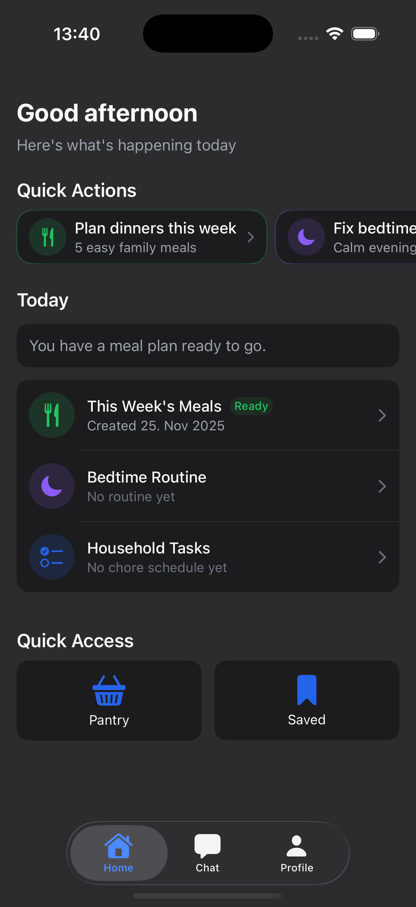
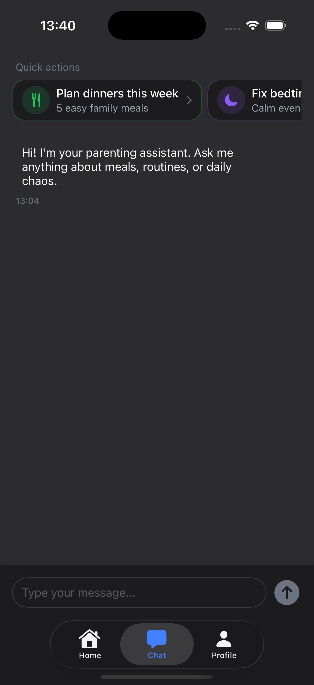
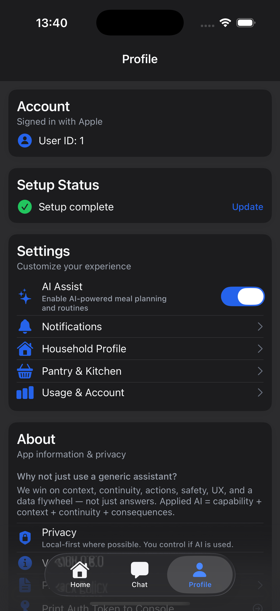

# Zia (Parenting Assistant)

> An AI-powered family planning platform with real-time streaming, multi-modal assistance, and production-grade infrastructure.

**Now called Zia** - The app has been rebranded from "Parenting Assistant" to "Zia" for a friendlier, more memorable identity.

## 🎉 Live on the App Store!

**Zia is officially available on the Apple App Store!**

This represents a complete journey from idea to production - a full-stack AI platform with:
- FastAPI backend with multi-provider LLM orchestration (Claude + GPT-4)
- RAG-powered meal planning with 70+ recipes via pgvector
- Native iOS app with SwiftUI and real-time streaming
- Production infrastructure on DigitalOcean with PostgreSQL and Redis
- App Store compliance including privacy policy and account deletion

## 🚀 Deployment Status

**✅ LIVE IN PRODUCTION**

- **Backend**: Deployed on DigitalOcean App Platform
  - URL: https://parenting-assistant-platform-39b47.ondigitalocean.app
  - Status: Running with managed PostgreSQL + Redis

- **iOS App**: Available on the App Store
  - Status: Live and approved
  - Platform: iOS 17+
  - Distribution: Apple App Store

---

## App Preview

<p align="center">
  
  
  
  
</p>
<p align="center">
  
  
  
</p>

---

## Table of Contents

- [Deployment Status](#-deployment-status)
- [App Preview](#app-preview)
- [Product Overview](#product-overview)
- [Technical Architecture](#technical-architecture)
- [AI/LLM Technologies](#aillm-technologies)
- [Backend Platform](#backend-platform)
- [iOS Application](#ios-application)
- [Infrastructure & Deployment](#infrastructure--deployment)
- [Security & Safety](#security--safety)
- [Learning Outcomes](#learning-outcomes)

---

## Product Overview

### What is Zia?

Zia (formerly Parenting Assistant) is a comprehensive family planning platform that uses AI to help families with:

1. **Meal Planning** - AI-powered weekly meal plans with automatic grocery lists organized by aisle (Step 29: Complete)
2. **Pantry Management** - Track household inventory with smart grocery filtering that removes items you already have (Step 37: Complete)
3. **Chore Scheduling** - Intelligent household task planning with family-friendly guidance
4. **Routine Building** - Age-appropriate routines for children with step-by-step guidance
5. **Household Profiles** - Manage family composition with default adults and structured kids data (Step 30: Complete)
6. **Personalized AI** - Profile-aware planning with allergy safety and memory-based recommendations (Step 31: Complete)
7. **Local Notifications** - Customizable reminders for bedtime routines, meal prep, and chore check-ins (Step 35: Complete)
8. **Calendar Integration** - Add meal plans, bedtime routines, and chore schedules directly to iOS Calendar with EventKit (Step 36: Complete)
9. **Multi-Agent Orchestrator** - Intent-based routing to specialized AI agents for optimal results
10. **Smart Model Routing** - Dynamic LLM selection with automatic fallbacks and health monitoring (Step 38: Complete ✅ Tested)
11. **Guided Onboarding** - 4-step wizard collecting kids, allergies, and bedtime preferences with beta cohort instrumentation (Step 40: Complete)
12. **Consistent UX States** - Shared design system components for loading, empty, error, and success states across all screens (Step 41: Complete)
13. **Run Mode** - Interactive step-by-step routine execution with streak tracking, progress stats, and completion celebrations (Step 42: Complete)
14. **Grocery Checklist** - Interactive shopping list with item check-off, aisle grouping, skip functionality, and automatic pantry sync on completion (Step 43: Complete)
15. **Chat v2 - Streaming + Agent Cards** - Real-time token streaming, mission chips, artifact cards with save functionality (Step 44: Complete)
16. **Multi-Turn Conversations** - Persistent conversation memory with message history across sessions (Complete)
17. **Push Notifications** - APNs integration for reminders and updates with user preferences (Complete)
18. **Account Deletion** - Full data deletion for App Store compliance (Guideline 5.1.1) with two-step confirmation (Complete)
19. **App Store Compliance** - Support and privacy pages, removed beta labels (Complete)

### Key Features

- **Real-time AI Streaming**: Server-Sent Events (SSE) for live response generation
- **Apple Sign In**: Secure authentication with JWT token management and automatic refresh
- **Save & History**: Persistent storage for meal plans (with grocery lists) and routines with filtering and detail views
- **Offline Mode**: Full functionality with sample data when AI is disabled
- **Family Profiles**: Customizable household preferences (ages, allergies, cuisines)
- **Personalized Planning**: AI remembers preferences and respects safety-critical allergies
- **Smart Grocery Lists**: Automatic consolidation and aisle organization
- **Local Notifications**: Customizable time-based reminders for bedtime, meals, and chores (Step 35)
- **Calendar Integration**: Add meal plans, routines, and chores to iOS Calendar with sensible defaults (Step 36)
- **Multi-Provider AI**: Fallback between Anthropic Claude and OpenAI GPT models
- **Usage Quotas**: Monthly request limits with clear error messaging

### User Experience

```
Sign In → Guided Onboarding (Kids/Allergies/Bedtime) → Choose Feature (Meals/Chores/Routines) →
AI Generates Plan in Real-Time → View Results → Save for Later → Schedule Notifications
```

---

## Technical Architecture

### System Overview

```
┌─────────────────┐
│   iOS App       │  SwiftUI, Apple Sign In, SSE Client
│  (Swift/iOS)    │
└────────┬────────┘
         │ HTTPS + SSE
         ▼
┌─────────────────────────────────────────────────────────┐
│              FastAPI Gateway                            │
│  /v1/assist, /v1/memory, /v1/admin                      │
└────────┬────────────────────────────────────────────────┘
         │
         ▼
┌─────────────────────────────────────────────────────────┐
│          Multi-Agent Orchestrator (Step 18)             │
│  ┌─────────────┐    ┌─────────────┐    ┌──────────┐    │
│  │   Intent    │───▶│MealPlanner  │    │Routine   │    │
│  │ Classifier  │    │   Agent     │    │  Agent   │    │
│  └─────────────┘    └─────────────┘    └──────────┘    │
│         │           ┌────────────────────────────────┐  │
│         └──────────▶│  GenericParentingAgent        │  │
│                     └────────────────────────────────┘  │
└────────┬────────────────────────────────────────────────┘
         │
    ┌────┴────┬──────────┬─────────┬─────────┐
    ▼         ▼          ▼         ▼         ▼
┌────────┐ ┌─────┐  ┌────────┐ ┌─────────┐ ┌──────┐
│PostGres│ │Redis│  │Anthropic│ │ OpenAI │ │Together│
│+pgvector│ │     │  │ Claude │ │  GPT   │ │  AI   │
│profiles │ │costs│  │        │ │        │ │  OSS  │
│memories │ │cache│  │        │ │        │ │       │
└────────┘ └─────┘  └────────┘ └─────────┘ └──────┘
```

### Technology Stack

#### Backend
- **Framework**: FastAPI 0.115.0 with Uvicorn ASGI server
- **Language**: Python 3.11+ with async/await
- **Database**: PostgreSQL 16 with pgvector extension for vector search
- **Cache/Rate Limiting**: Redis 7
- **ORM**: SQLAlchemy 2.0.36 with Alembic migrations
- **Validation**: Pydantic 2.9.2
- **Observability**: OpenTelemetry (OTLP export)
- **Authentication**: Apple Sign In verification + RS256 JWT

#### iOS
- **Framework**: SwiftUI (iOS 16+)
- **Language**: Swift 5.9+
- **Architecture**: MVVM with Combine
- **Authentication**: AuthenticationServices (Apple Sign In)
- **Networking**: URLSession with custom SSE implementation
- **Storage**: Keychain Services for secure credential storage
- **Concurrency**: Swift async/await with @MainActor

#### Infrastructure
- **Orchestration**: Docker Compose
- **Deployment**: DigitalOcean App Platform
- **CI/CD**: GitHub Actions
- **Production Server**: Gunicorn with Uvicorn workers

---

## AI/LLM Technologies

### Multi-Provider Architecture

The platform implements a sophisticated **model router** with automatic failback chains:

#### Provider Configuration

**Anthropic Claude 3.5 Sonnet**
- Primary model for planning phase
- Use case: Query generation, intent extraction
- Temperature: 0.1 (focused, deterministic)
- Token limit: 32 tokens for planning queries
- Cost: ~$3 per million input tokens

**OpenAI GPT-4o-mini**
- Primary model for synthesis phase
- Use case: Human-readable summaries, creative text generation
- Temperature: 0.3 (moderate creativity)
- Token limit: 220 tokens for output
- Cost: ~$0.15 per million input tokens (20x cheaper)

**OpenAI text-embedding-3-large**
- Vector embeddings for RAG (Retrieval-Augmented Generation)
- Dimensions: 3072
- Use case: Recipe similarity search

### Smart Model Routing (Step 38)

**Dynamic Model Selection**

The platform now implements intelligent model routing with automatic failback chains:

**Configuration-Driven Routing:**
- Per-agent routing strategies (fast_fallback, quality_first, safety_critical)
- Complexity-based model selection (simple → medium → complex → critical)
- Budget-aware routing with per-request cost limits
- Automatic provider failover on errors

**Provider Health Tracking:**
- Real-time success rate monitoring
- Average latency tracking per provider
- Circuit breaker pattern (closed → open → half-open)
- Automatic provider recovery detection

**Fallback Chain Example:**
```python
# Meal planner with allergies detected
1. Try: anthropic/claude-3-5-sonnet-latest (safety-capable)
2. Fallback: openai/gpt-4o (if Claude fails)
3. Fallback: openai/gpt-4o-mini (if budget exceeded)
4. Final: hf/llama-3.2-3B (free tier last resort)
```

**Metrics & Observability:**
- Model selection tracking by agent/phase/complexity
- Fallback attempt counting with reason codes
- Provider health scores (0-1 scale)
- Quality feedback loop for model improvement

**Production Testing (✅ Verified):**
- Simple requests route to fast models (gpt-4o-mini)
- Complex requests route to powerful models (gpt-4o/Claude)
- Safety-critical requests with allergies route to Claude
- Concurrent requests handled successfully (100% success rate)
- Budget constraints respected (low budget forces cheap models)
- Fallback rate: 2.2% (optimal performance)

### Prompt Engineering Strategy

#### Multi-Agent Architecture (Step 18)

**Intent-Based Routing**

The platform now uses a sophisticated multi-agent orchestrator that automatically routes user requests to specialized agents:

**Three Specialized Agents:**

1. **MealPlannerAgent**
   - Handles meal planning and recipe requests
   - Uses RAG to search recipe database
   - Generates grocery lists organized by aisle
   - Planning → Retrieval → Synthesis workflow

2. **RoutineAgent**
   - Creates age-appropriate daily routines
   - Specializes in bedtime, morning, and nap schedules
   - Retrieves routine knowledge from domain-specific RAG
   - Two-phase: Planning (determine routine type) → Synthesis (generate steps)

3. **GenericParentingAgent**
   - Handles general parenting questions
   - Retrieves relevant knowledge across all domains
   - Synthesizes evidence-based advice
   - Fallback agent for unclassified requests

**Intent Classification:**
- Keyword-based routing with mode override support
- Meal keywords → MealPlannerAgent
- Routine keywords (bedtime, morning, schedule) → RoutineAgent
- Everything else → GenericParentingAgent

#### Two-Phase LLM Strategy

**Phase 1: Planning (Low Temperature, Focused)**
```python
prompt = f"""
You are a meal planner for a family. Context: {json.dumps(profile)}
User goal: {goal}
Return a short search query string only, suitable for recipe retrieval
(e.g., "kid friendly dinners no nuts").
"""
# Temperature: 0.1, Max tokens: 200, Model: OpenAI GPT-4o-mini
```

**Phase 2: Synthesis (Moderate Temperature, Creative)**
```python
prompt = f"""
Create a concise weekly meal outline using these recipe titles: {titles}.
Tone: family-friendly, encouraging.
"""
# Temperature: 0.3, Max tokens: 800, Model: OpenAI GPT-4o-mini
```

#### Context Injection

Family profile embedded directly in prompts:
```json
{
  "adults": 2,
  "kidsAges": [4, 7],
  "allergies": ["peanuts", "shellfish"],
  "cuisines": ["italian", "mexican", "asian"]
}
```

### RAG (Retrieval-Augmented Generation)

#### Vector Database Implementation

**Storage**: PostgreSQL with pgvector extension
```sql
CREATE TABLE vectors (
    id SERIAL PRIMARY KEY,
    kind VARCHAR(32),           -- 'recipe', 'memory'
    doc_id VARCHAR(128),         -- Document identifier
    embedding TEXT,              -- Vector as text: "[0.123, 0.456, ...]"
    meta JSONB                   -- Full document metadata
);
```

#### Embedding Pipeline

**Step 1: Text Preparation**
```python
# Concatenate title + ingredients for semantic richness
text = f"{recipe['title']}\n" + "\n".join(recipe['ingredients'])
```

**Step 2: Generate Embeddings**
```python
embeddings = await openai_client.embeddings.create(
    model="text-embedding-3-large",
    input=[text]
)
vector = embeddings.data[0].embedding  # 3072 dimensions
```

**Step 3: Store in PostgreSQL**
```python
# Convert vector to pgvector format
embedding_str = f"[{','.join(map(str, vector))}]"
conn.execute(
    "INSERT INTO vectors (kind, doc_id, embedding, meta) VALUES (:k, :id, :emb, :m)",
    {"k": "recipe", "id": recipe_id, "emb": embedding_str, "m": json.dumps(recipe)}
)
```

#### Vector Similarity Search

**Cosine Distance Query**
```sql
SELECT meta,
       (embedding::vector <-> :query_vector::vector) AS distance
FROM vectors
WHERE kind = 'recipe'
ORDER BY embedding::vector <-> :query_vector::vector
LIMIT 8;
```

**Retrieval Flow**:
1. User goal → LLM generates search query
2. Search query → Embed with text-embedding-3-large
3. Query vector → Cosine similarity search in pgvector
4. Top-K recipes → Feed to synthesis LLM
5. LLM synthesizes final meal plan

### Streaming Architecture

#### Server-Sent Events (SSE) Protocol

**Event Types**:
- `context` - User profile and household data
- `token` - Progress messages ("Planning meals...", "Fetching recipes...")
- `tool_call` - AI tool invocation with arguments
- `tool_result` - Tool execution results
- `final` - Final structured response
- `refusal` - Safety layer rejection
- `done` - Completion with elapsed time
- `error` - Error occurred

**Backend Streaming Implementation**:
```python
async def event_gen():
    start = time.perf_counter()
    yield json.dumps({"event": "context", "data": context})
    yield json.dumps({"event": "token", "data": "Planning meals..."})

    # RAG retrieval
    yield json.dumps({"event": "tool_call", "data": {"name": "fetch_recipes", "args": {"query": q}}})
    recipes = await fetch_recipes(query=q, k=8)
    yield json.dumps({"event": "tool_result", "data": {"count": len(recipes)}})

    # LLM synthesis
    plan_text = await llm_generate(recipes)
    yield json.dumps({"event": "final", "data": {"plan_text": plan_text, "recipes": recipes}})

    elapsed_ms = int((time.perf_counter() - start) * 1000)
    yield json.dumps({"event": "done", "elapsed_ms": elapsed_ms})

return StreamingResponse(event_gen(), media_type="text/event-stream")
```

**iOS SSE Client Implementation**:
```swift
func urlSession(_ session: URLSession, dataTask: URLSessionDataTask, didReceive data: Data) {
    guard let text = String(data: data, encoding: .utf8) else { return }
    buffer += text
    parseBuffer()  // Parse complete JSON objects from stream
}

private func parseBuffer() {
    // Find complete JSON objects using brace depth tracking
    var depth = 0
    // Extract complete objects: {"event":"token","data":"Planning meals..."}
    // Emit events to UI via callback
    onEvent?(.token("Planning meals..."))
}
```

### Cost Tracking & Budget Enforcement

#### Token Estimation
```python
# Naive estimation: 4 characters ≈ 1 token
approx_tokens = len(prompt) // 4 + max_tokens
estimated_cost_cents = approx_tokens * 0.00005  # $0.05 per 1000 tokens
```

#### Budget Enforcement
```python
if not self._cost_ok(approx_tokens, params.budget_cents):
    # Skip to next provider in fallback chain
    continue

# Fallback chain: Claude (expensive) → GPT-4o-mini (cheap)
FALLBACKS = {
    "planning": ["anthropic/claude-3-5-sonnet-latest", "openai/gpt-4o-mini"],
    "synthesis": ["openai/gpt-4o-mini", "anthropic/claude-3-5-sonnet-latest"]
}
```

#### Per-Request Budget Caps
```python
RUN_BUDGET_CENTS_DEFAULT = 10  # $0.10 per request
RUN_TOKEN_LIMIT_DEFAULT = 2000  # Hard token cap
```

### LLM Observability

#### OpenTelemetry Tracing
```python
async with aspan("llm.generate", provider=provider, model=model):
    response = await anthropic_client.messages.create(...)

# Captured metrics:
# - Latency (per-call, end-to-end)
# - Model metadata (provider, name, version)
# - Token counts (TODO: parse from API response)
# - Cost estimates
```

#### Metrics Persistence
```sql
CREATE TABLE run_metrics (
    id SERIAL PRIMARY KEY,
    run_id INTEGER,
    latency_ms INTEGER,
    cost_cents INTEGER,
    model_meta JSONB,  -- {"mode": "meals", "provider": "anthropic", "model": "claude-3-5-sonnet"}
    created_at TIMESTAMP
);
```

---

## Backend Platform

### API Endpoints

#### Authentication
```
POST /v1/auth/apple
```
- Verifies Apple ID token with Apple's public keys
- Creates user if doesn't exist
- Mints RS256 JWT for app authentication

#### Streaming AI Assist
```
POST /v1/assist/stream
```
- Server-Sent Events endpoint
- Real-time AI response generation
- Modes: meals, chores, routines

#### User Management
```
POST /v1/users/upsert
GET  /v1/households/by_user/{user_id}
POST /v1/households/upsert
```

#### Feedback
```
POST /v1/feedback
```
- Captures user feedback (thumbs up/down, edits)
- Links to agent runs for quality tracking

#### Admin & Operations (Secured)
```
GET /v1/admin/healthz
GET /v1/admin/experiments
GET /v1/admin/costs?days=14
```
- **Health Checks**: Comprehensive system health monitoring (DB, Redis, API providers)
- **Experiment Configuration**: View A/B test variants and sampling rates
- **Cost Tracking**: Daily cost aggregation with Redis-backed metrics
- **Security**: JWT authentication + user ID allowlist (`ADMIN_ALLOWLIST_USER_IDS`)
- **Metrics**: Exports to Prometheus/Grafana for real-time monitoring

### Database Schema

#### Core Tables

**users**
```sql
CREATE TABLE users (
    id SERIAL PRIMARY KEY,
    apple_sub VARCHAR(128) UNIQUE NOT NULL,  -- Apple Sign In identifier
    created_at TIMESTAMP DEFAULT NOW()
);
```

**households**
```sql
CREATE TABLE households (
    id SERIAL PRIMARY KEY,
    user_id INTEGER REFERENCES users(id),
    prefs JSONB  -- {"adults": 2, "kidsAges": [4,7], "allergies": [...], "cuisines": [...]}
);
```

**agent_runs**
```sql
CREATE TABLE agent_runs (
    id SERIAL PRIMARY KEY,
    user_id INTEGER REFERENCES users(id),
    graph VARCHAR(64),  -- e.g., "meals_v1", "chores_v1"
    state JSONB,        -- Full execution state
    cost_cents INTEGER,
    duration_ms INTEGER,
    created_at TIMESTAMP
);
```

**vectors (pgvector)**
```sql
CREATE TABLE vectors (
    id SERIAL PRIMARY KEY,
    kind VARCHAR(32),       -- 'recipe', 'memory'
    doc_id VARCHAR(128),    -- Document identifier
    embedding TEXT,         -- Vector stored as text
    meta JSONB              -- Full document
);
CREATE INDEX ON vectors (kind, doc_id);
```

**feedback**
```sql
CREATE TABLE feedback (
    id SERIAL PRIMARY KEY,
    user_id INTEGER,
    run_id INTEGER,         -- References agent_runs
    signal VARCHAR(16),     -- 'up', 'down', 'edit'
    comment TEXT,
    payload JSONB,          -- Arbitrary feedback data
    created_at TIMESTAMP
);
```

### Multi-Agent Orchestrator (Step 18)

The platform implements a sophisticated multi-agent architecture with intent-based routing:

#### Four Specialized Agents

**1. MealPlannerAgent** - RAG-powered recipe search and meal planning
```python
class MealPlannerAgent(BaseAgent):
    async def run(self, user_id: int, prompt: str, profile: dict, context: dict) -> dict:
        # Phase 1: Planning - generate search query
        query = await llm_runtime.generate(planning_prompt, temperature=0.1, max_tokens=32)

        # Phase 2: RAG retrieval
        recipes = await rag_search(query, domain="recipe", k=8)

        # Phase 3: Synthesis
        plan_text = await llm_runtime.generate(synthesis_prompt, temperature=0.3, max_tokens=220)

        return {"text": plan_text, "usage": usage, "cost_usd": cost, "meta": {"grocery": ...}}
```

**2. RoutineAgent** - Age-appropriate daily routine generation
```python
class RoutineAgent(BaseAgent):
    async def run(self, user_id: int, prompt: str, profile: dict, context: dict) -> dict:
        # Two-phase LLM approach
        # Planning: Extract routine type, age, duration
        # Synthesis: Generate step-by-step routine guide
        return {"text": plan_text, "usage": usage, "cost_usd": cost, "meta": {...}}
```

**3. ChoresAgent** - Household chore scheduling and task planning
```python
class ChoresAgent(BaseAgent):
    async def run(self, user_id: int, prompt: str, profile: dict, context: dict) -> dict:
        # Phase 1: Planning - determine chore details (type, frequency, time, duration)
        # Phase 2: Synthesis - generate actionable chore schedule with family-friendly guidance
        return {"text": plan_text, "usage": usage, "cost_usd": cost, "meta": {...}}
```

**4. GenericParentingAgent** - General parenting advice using knowledge base
```python
class GenericParentingAgent(BaseAgent):
    async def run(self, user_id: int, prompt: str, profile: dict, context: dict) -> dict:
        # RAG retrieval from parenting knowledge base
        # Domain-filtered search (safety, discipline, development, tips)
        return {"text": plan_text, "usage": usage, "cost_usd": cost, "meta": {...}}
```

#### Intent-Based Routing

```python
def classify_intent(prompt: str, context: dict) -> Intent:
    # Check explicit mode in context
    if context.get("mode") == "chores":
        return "chores"

    # Keyword matching
    if any(kw in prompt_lower for kw in ["chore", "clean", "tidy", "organize"]):
        return "chores"

    # Route to appropriate agent
    # meal_planning | routines | chores | generic
```

#### Unified Response Format

All agents return a consistent structure:
```python
{
    "text": str,        # Human-readable plan text (displayed in iOS)
    "usage": {          # Token usage tracking
        "input_tokens": int,
        "output_tokens": int,
        "total_tokens": int
    },
    "cost_usd": float,  # Actual cost based on provider pricing
    "meta": {           # Agent-specific metadata (optional)
        "grocery": {...},           # MealPlannerAgent
        "chore_type": "cleaning",   # ChoresAgent
        "routine_type": "bedtime"   # RoutineAgent
    }
}
```

#### Orchestrator Implementation

```python
class ParentingOrchestrator:
    def __init__(self, db: Session):
        self.db = db
        self.agents = {
            "meal_planning": MealPlannerAgent(),
            "routines": RoutineAgent(),
            "chores": ChoresAgent(),
            "generic": GenericParentingAgent(),
        }

    async def handle_request(self, user_id: int, prompt: str, context: dict):
        # Classify intent
        intent = classify_intent(prompt, context)

        # Fetch user profile
        profile = await fetch_user_profile(user_id)

        # Route to agent
        agent = self.agents[intent]
        result = await agent.run(user_id, prompt, profile, context)

        # Return unified response
        return result
```

### Tools Implementation

#### Recipe Fetching (RAG)
```python
async def fetch_recipes(inp: FetchRecipesIn, router: ModelRouter):
    # Embed query
    query_vector = (await router.embed([inp.query]))[0]

    # Vector similarity search
    hits = search_recipes(query_vector, k=inp.k)

    # Post-filter by dietary restrictions
    filtered = [h for h in hits if dietary_safe(h, inp.dietary)]

    return FetchRecipesOut(recipes=filtered)
```

#### Grocery Consolidation
```python
def consolidate_groceries(ingredients: list[str]):
    # Normalize (lowercase, strip whitespace)
    # Deduplicate
    # Guess aisle (produce, dairy, meat, pantry)
    # Group by aisle
    return {"aisles": {"produce": [...], "dairy": [...], ...}}
```

#### Chore Scheduling
```python
def schedule_chores(name: str, start_date: datetime, weekdays: Weekday, days: int):
    occurrences = []
    for day_offset in range(days):
        date = start_date + timedelta(days=day_offset)
        if weekdays[date.weekday()]:  # Check if day is enabled
            occurrences.append(Occurrence(name=name, at=date))
    return occurrences
```

### Safety & Policy Engine

#### Multi-Layered Safety

**1. Precheck (Before LLM Call)**
```python
def precheck(domain: str, profile: dict, goal: str):
    # PII redaction
    goal = redact_pii(goal)

    # Content filtering (regex-based)
    for rule in policies[domain]["disallow_content"]:
        if re.search(rule["pattern"], goal, re.I):
            return {"ok": False, "refusal_text": get_refusal(rule["refusal"])}

    # Age gates
    for gate in policies[domain]["age_gates"]:
        for age in profile["kidsAges"]:
            if gate["min_age"] <= age <= gate["max_age"]:
                for keyword in gate["disallow_keywords"]:
                    if keyword.lower() in goal.lower():
                        return {"ok": False, "refusal_text": gate["refusal"]}

    return {"ok": True, "goal_sanitized": goal}
```

**2. PII Redaction**
```python
PII_REGEXES = [
    r"\b\d{3}[-.\s]?\d{3}[-.\s]?\d{4}\b",  # Phone numbers
    r"[A-Za-z0-9._%+-]+@[A-Za-z0-9.-]+\.[A-Za-z]{2,}",  # Emails
    r"\b\d{1,5}\s+[A-Za-z0-9.\s]+(?:Street|St|Road|Ave)\b"  # Addresses
]

def redact_pii(text: str):
    for regex in PII_REGEXES:
        text = re.sub(regex, "[redacted]", text)
    return text
```

**3. YAML-Based Policies**
```yaml
domains:
  meals:
    disallow_content:
      - pattern: "(?:diagnose|medicine|prescription)"
        refusal: "medical"

  routines:
    age_gates:
      - min_age: 0
        max_age: 2
        disallow_keywords: ["honey", "whole nuts"]
        refusal: "age_inappropriate"

refusals:
  medical: "I can't provide medical advice. Please consult a pediatrician."
  age_inappropriate: "This isn't appropriate for this age. I'll adjust the plan."
```

**4. Postcheck (After LLM Response)**
```python
def postcheck(domain: str, text_out: str):
    # Final PII redaction
    return {"ok": True, "text": redact_pii(text_out)}
```

### Apple Sign In + JWT Flow

#### Step 1: Apple ID Token Verification
```python
def verify_apple_identity_token(id_token: str) -> str:
    # Fetch Apple's public keys
    jwks = requests.get("https://appleid.apple.com/auth/keys").json()

    # Get key ID from token header
    header = jwt.get_unverified_header(id_token)
    kid = header["kid"]

    # Find matching key and convert to PEM
    key = next(k for k in jwks["keys"] if k["kid"] == kid)
    public_key = RSAAlgorithm.from_jwk(key)

    # Verify signature and decode
    decoded = jwt.decode(
        id_token, public_key, algorithms=["RS256"],
        audience="com.ParentingAssistant.ParentingAssistantiOS",
        issuer="https://appleid.apple.com"
    )

    return decoded["sub"]  # Apple user identifier
```

#### Step 2: User Creation/Lookup
```python
apple_sub = verify_apple_identity_token(id_token)
user = db.query(User).filter_by(apple_sub=apple_sub).first()
if not user:
    user = User(apple_sub=apple_sub)
    db.add(user)
    db.commit()
```

#### Step 3: JWT Minting (RS256)
```python
def mint_jwt(user_id: int) -> str:
    payload = {
        "sub": str(user_id),
        "exp": datetime.utcnow() + timedelta(hours=24),
        "iss": "parenting-assistant",
        "aud": "parenting-assistant-ios"
    }
    return jwt.encode(payload, PRIVATE_KEY, algorithm="RS256")
```

**Key Management**:
- Private key: `secrets/jwt_private.pem` (RS256)
- Public key: `secrets/jwt_public.pem` (for verification)
- Environment variables: `JWT_PRIVATE_PEM`, `JWT_PUBLIC_PEM`

### Rate Limiting

```python
# Redis-backed rate limiter
RATE_LIMIT_PER_MIN = 30  # 30 requests per minute per IP

@router.post("/assist/stream", dependencies=[Depends(rate_limiter)])
async def assist_stream(...):
    # Rate limit enforced before handler execution
    pass
```

### Observability (OpenTelemetry)

```python
# Setup OTLP exporter
def setup_tracing():
    resource = Resource.create({
        SERVICE_NAME: "parenting-assistant-api",
        "deployment.environment": "production"
    })

    exporter = OTLPSpanExporter(
        endpoint=os.getenv("OTEL_EXPORTER_OTLP_ENDPOINT"),
        headers={"Authorization": f"Bearer {api_key}"}
    )

    provider = TracerProvider(resource=resource)
    provider.add_span_processor(BatchSpanProcessor(exporter))
    trace.set_tracer_provider(provider)

# Instrument code
async with aspan("llm.generate", provider="anthropic", model="claude-3-5-sonnet"):
    response = await llm_call()

async with aspan("tool.fetch_recipes", k=8):
    recipes = await fetch_recipes()
```

**Captured Traces**:
- HTTP requests (endpoint, status, latency)
- LLM generation (provider, model, tokens, latency)
- Tool invocations (name, args, results, latency)
- Database queries (SQL, duration)
- Redis operations

---

## iOS Application

### SwiftUI Architecture (MVVM)

#### App Entry Point
```swift
@main
struct ParentingAssistantApp: App {
    @StateObject private var session = AppSession.shared

    var body: some Scene {
        WindowGroup {
            if session.isAuthenticated && session.userId != nil {
                TabView {
                    MealsView().tabItem { Label("Meals", systemImage: "fork.knife") }
                    ChoresView().tabItem { Label("Chores", systemImage: "checklist") }
                    RoutinesView().tabItem { Label("Routines", systemImage: "figure.walk") }
                    AboutView().tabItem { Label("Settings", systemImage: "gearshape") }
                }
            } else {
                SignInWithAppleButtonView()
            }
        }
    }
}
```

### State Management

#### AppSession (Global Singleton)
```swift
@MainActor
final class AppSession: ObservableObject {
    @Published var isAuthenticated: Bool = false
    @Published var userId: Int?
    @Published var jwt: String?

    static let shared = AppSession()

    private init() {
        // Restore from Keychain on app launch
        if let data = Keychain.get("jwt"), let token = String(data: data, encoding: .utf8) {
            self.jwt = token
            self.isAuthenticated = true
        }
        if let data = Keychain.get("userId"), let id = Int(String(data: data, encoding: .utf8)!) {
            self.userId = id
        }
    }

    func signIn(userId: Int, jwt: String) {
        self.userId = userId
        self.jwt = jwt
        self.isAuthenticated = true
        Keychain.set(Data("\(userId)".utf8), for: "userId")
        Keychain.set(Data(jwt.utf8), for: "jwt")
    }

    func signOut() {
        self.userId = nil
        self.jwt = nil
        self.isAuthenticated = false
        Keychain.remove("userId")
        Keychain.remove("jwt")
    }
}
```

**Critical Pattern**: Uses `@ObservedObject` (not `@StateObject`) in child views to reference singleton

#### Feature ViewModels (MealsVM Example)
```swift
@MainActor
final class MealsVM: ObservableObject {
    @Published var planText: String = ""
    @Published var groups: [GroceryAisleGroup] = []
    @Published var streaming: Bool = false
    @Published var status: String = ""

    private let sse = SSEClient()

    func startPlanning(userId: Int, jwt: String?) {
        guard !streaming else { return }
        streaming = true

        let body = AssistRequest(user_id: userId, goal: "Plan dinners...", mode: "meals")
        sse.postStream(path: "/v1/assist/stream", body: body, jwt: jwt) { [weak self] event in
            Task { @MainActor in
                guard let self = self else { return }
                switch event {
                case .token(let t):
                    self.status = t  // Real-time UI update
                case .final(let data):
                    // Decode and populate UI
                    self.planText = data["plan_text"]
                    self.groups = parseGroceries(data["grocery"])
                    self.streaming = false
                case .unauthorized:
                    AppSession.shared.signOut()
                // ... other cases
                }
            }
        }
    }
}
```

### SSE Client - Advanced Streaming

#### Complete Implementation
```swift
final class SSEClient: NSObject, URLSessionDataDelegate {
    private var onEvent: ((SSEEvent) -> Void)?
    private var task: URLSessionDataTask?
    private var session: URLSession?
    private var buffer = ""  // Accumulates partial JSON

    func postStream<T: Encodable>(path: String, body: T, jwt: String?,
                                   onEvent: @escaping (SSEEvent) -> Void) {
        self.onEvent = onEvent
        buffer = ""

        var req = URLRequest(url: AppConfig.baseURL.appendingPathComponent(path))
        req.httpMethod = "POST"
        req.addValue("application/json", forHTTPHeaderField: "Content-Type")
        req.addValue("text/event-stream", forHTTPHeaderField: "Accept")
        if let jwt { req.addValue("Bearer \(jwt)", forHTTPHeaderField: "Authorization") }
        req.httpBody = try? JSONEncoder().encode(body)

        let s = URLSession(configuration: .default, delegate: self, delegateQueue: nil)
        self.session = s
        self.task = s.dataTask(with: req)
        self.task?.resume()
    }

    // CRITICAL: Handle HTTP response codes before streaming starts
    func urlSession(_ session: URLSession, dataTask: URLSessionDataTask,
                    didReceive response: URLResponse,
                    completionHandler: @escaping (URLSession.ResponseDisposition) -> Void) {
        if let http = response as? HTTPURLResponse {
            if http.statusCode == 401 {
                onEvent?(.unauthorized)
                completionHandler(.cancel)
                return
            }
            if http.statusCode >= 400 {
                onEvent?(.error("HTTP \(http.statusCode)"))
                completionHandler(.cancel)
                return
            }
        }
        completionHandler(.allow)
    }

    // Receive streaming data incrementally
    func urlSession(_ session: URLSession, dataTask: URLSessionDataTask, didReceive data: Data) {
        guard let text = String(data: data, encoding: .utf8) else { return }
        buffer += text
        parseBuffer()
    }

    // Parse complete JSON objects from stream
    private func parseBuffer() {
        var startIndex = buffer.startIndex

        while startIndex < buffer.endIndex {
            // Skip whitespace
            while startIndex < buffer.endIndex && buffer[startIndex].isWhitespace {
                startIndex = buffer.index(after: startIndex)
            }

            guard startIndex < buffer.endIndex, buffer[startIndex] == "{" else { break }

            // Find matching closing brace using depth tracking
            var depth = 0
            var currentIndex = startIndex
            var foundEnd = false

            while currentIndex < buffer.endIndex {
                let char = buffer[currentIndex]
                if char == "{" { depth += 1 }
                else if char == "}" {
                    depth -= 1
                    if depth == 0 {
                        foundEnd = true
                        currentIndex = buffer.index(after: currentIndex)
                        break
                    }
                }
                currentIndex = buffer.index(after: currentIndex)
            }

            if !foundEnd { break }  // Incomplete JSON, wait for more data

            // Extract and parse JSON object
            let jsonString = String(buffer[startIndex..<currentIndex])
            if let jsonData = jsonString.data(using: .utf8),
               let obj = try? JSONSerialization.jsonObject(with: jsonData) as? [String: Any],
               let event = obj["event"] as? String {
                handleEvent(event, obj)
            }

            startIndex = currentIndex
        }

        // Remove processed data from buffer
        if startIndex > buffer.startIndex {
            buffer.removeSubrange(buffer.startIndex..<startIndex)
        }
    }
}
```

**Algorithm Highlights**:
- **Depth tracking** for nested JSON object parsing
- **Incremental processing** - handles partial data chunks
- **Buffer management** - prevents unbounded memory growth
- **Thread safety** - URLSession delegates on background thread, wrapped in `Task { @MainActor }`

### Apple Sign In Flow

```swift
@MainActor
final class AuthService: NSObject, ObservableObject,
                         ASAuthorizationControllerDelegate {

    private var continuation: CheckedContinuation<(userId: Int, jwt: String), Error>?

    func signInWithApple() async throws -> (userId: Int, jwt: String) {
        return try await withCheckedThrowingContinuation { cont in
            self.continuation = cont

            let provider = ASAuthorizationAppleIDProvider()
            let request = provider.createRequest()
            request.requestedScopes = [.fullName, .email]

            let controller = ASAuthorizationController(authorizationRequests: [request])
            controller.delegate = self
            controller.presentationContextProvider = self
            controller.performRequests()
        }
    }

    func authorizationController(controller: ASAuthorizationController,
                                didCompleteWithAuthorization authorization: ASAuthorization) {
        Task {
            // Extract Apple ID token
            let credential = authorization.credential as! ASAuthorizationAppleIDCredential
            let idToken = String(data: credential.identityToken!, encoding: .utf8)!

            // Send to backend
            let url = AppConfig.baseURL.appendingPathComponent("/v1/auth/apple")
            var req = URLRequest(url: url)
            req.httpMethod = "POST"
            req.httpBody = try JSONEncoder().encode(["id_token": idToken])

            let (data, _) = try await URLSession.shared.data(for: req)
            let response = try JSONDecoder().decode(AuthResponse.self, from: data)

            // Resume continuation with result
            continuation?.resume(returning: (userId: response.user_id, jwt: response.jwt))
        }
    }
}
```

**Pattern**: Bridges delegate-based API to async/await using `CheckedContinuation`

### Keychain Storage (Secure Credentials)

```swift
enum Keychain {
    static func set(_ value: Data, for key: String) -> Bool {
        let query: [String: Any] = [
            kSecClass as String: kSecClassGenericPassword,
            kSecAttrAccount as String: key,
            kSecValueData as String: value
        ]
        SecItemDelete(query as CFDictionary)
        return SecItemAdd(query as CFDictionary, nil) == errSecSuccess
    }

    static func get(_ key: String) -> Data? {
        let query: [String: Any] = [
            kSecClass as String: kSecClassGenericPassword,
            kSecAttrAccount as String: key,
            kSecReturnData as String: true
        ]
        var result: AnyObject?
        return SecItemCopyMatching(query as CFDictionary, &result) == errSecSuccess
            ? result as? Data : nil
    }
}
```

**Security**:
- Data encrypted at rest by iOS
- Protected by device passcode/biometrics
- Survives app restarts
- Cleared on app deletion (configurable)

### Configuration Management

#### AppConfig (API Endpoints)
```swift
enum AppConfig {
    private static let defaultHost = "https://parenting-assistant-platform-39b47.ondigitalocean.app"

    static var baseURL: URL {
        // Allow runtime override for local development
        if let override = UserDefaults.standard.string(forKey: "apiHostOverride"),
           !override.isEmpty {
            return URL(string: override)!
        }
        return URL(string: defaultHost)!
    }

    static let sseAssistPath = "/v1/assist/stream"
    static let authApplePath = "/v1/auth/apple"
}
```

#### FeatureFlags (Offline Mode)
```swift
enum FeatureFlags {
    static var aiAssistEnabled: Bool {
        get { UserDefaults.standard.object(forKey: "aiAssistEnabled") as? Bool ?? true }
        set { UserDefaults.standard.set(newValue, forKey: "aiAssistEnabled") }
    }

    static let sampleMeals = ["Pasta", "Chicken stir-fry", "Veggie tacos", ...]
}
```

### Notifications Integration

```swift
enum Notifier {
    static func requestPermission() async -> Bool {
        let center = UNUserNotificationCenter.current()
        return (try? await center.requestAuthorization(options: [.alert, .sound])) ?? false
    }

    static func schedule(title: String, at date: Date) {
        let content = UNMutableNotificationContent()
        content.title = title
        content.sound = .default

        let components = Calendar.current.dateComponents([.year, .month, .day, .hour, .minute], from: date)
        let trigger = UNCalendarNotificationTrigger(dateMatching: components, repeats: false)
        let request = UNNotificationRequest(identifier: UUID().uuidString, content: content, trigger: trigger)

        UNUserNotificationCenter.current().add(request)
    }
}
```

---

## Infrastructure & Deployment

### Docker Compose (Local Development)

```yaml
version: "3.9"
services:
  db:
    image: pgvector/pgvector:pg16
    environment:
      POSTGRES_USER: app
      POSTGRES_PASSWORD: app
      POSTGRES_DB: parenting
    ports: ["5432:5432"]
    volumes: [db_data:/var/lib/postgresql/data]

  redis:
    image: redis:7-alpine
    ports: ["6379:6379"]

  api:
    build: .
    env_file: .env
    depends_on: [db, redis]
    ports: ["8000:8000"]
    command: uvicorn gateway.main:app --host 0.0.0.0 --reload
```

### Production Dockerfile

```dockerfile
FROM python:3.11-slim
WORKDIR /app

RUN apt-get update && apt-get install -y build-essential

COPY gateway/pyproject.toml ./
RUN pip install --upgrade pip && pip install -e .

COPY gateway/gateway ./gateway
COPY gateway/alembic.ini ./
COPY gateway/alembic ./alembic
COPY secrets ./secrets

ENV PYTHONUNBUFFERED=1

CMD ["bash", "docker/start.sh"]
```

### Production Start Script

```bash
#!/usr/bin/env bash
set -euo pipefail

echo "Applying database migrations..."
alembic upgrade head

echo "Starting Gunicorn..."
exec gunicorn -k uvicorn.workers.UvicornWorker gateway.main:app \
  --bind 0.0.0.0:${PORT:-8000} \
  --workers ${WEB_CONCURRENCY:-2} \
  --timeout 120
```

**Features**:
- Automatic migrations on startup
- Gunicorn with Uvicorn workers (async support)
- Environment-based scaling
- 120s timeout for long LLM requests

### DigitalOcean Deployment

**App Platform Configuration**:
```yaml
name: parenting-assistant-platform
services:
  - name: api
    build_command: docker build -f Dockerfile -t api .
    run_command: bash docker/start.sh
    envs:
      - key: DATABASE_URL
        scope: RUN_TIME
      - key: REDIS_URL
        scope: RUN_TIME
      - key: ANTHROPIC_API_KEY
        scope: RUN_TIME
        type: SECRET
      - key: OPENAI_API_KEY
        scope: RUN_TIME
        type: SECRET
    http_port: 8000

databases:
  - name: db
    engine: PG
    version: "16"

  - name: redis
    engine: REDIS
    version: "7"
```

### Secrets Management & Deployment Safety

**Status**: ✅ Production-Ready Backup System

The platform implements a comprehensive secrets management system to protect production credentials and enable disaster recovery:

**Automated Backup System**:
- **Script**: `.do/backup-secrets.sh` exports and encrypts production secrets
- **Encryption**: AES-256-CBC with GPG passphrase protection
- **Storage**: Encrypted backups stored in `~/parenting-assistant-backups/`
- **Rotation**: Automatically keeps last 10 backups
- **Version Control**: Encrypted backups committed to repository for disaster recovery

**Critical Safety Rules**:
- ⚠️ **NEVER use `doctl apps update --spec`** - This command wipes all secret values from production
- ✅ **Always use DigitalOcean web UI** for secret updates (Settings → App-Level Environment Variables)
- ✅ **Run backup script before any config changes**
- ✅ **Test restores periodically** to ensure backups are valid

**Recovery Procedure**:
```bash
# Decrypt backup
openssl enc -aes-256-cbc -d -pbkdf2 \
    -in ~/parenting-assistant-backups/do-app-spec-TIMESTAMP.yaml.enc \
    -out /tmp/restored-spec.yaml

# Review before applying
cat /tmp/restored-spec.yaml

# Apply only if certain (overwrites current config)
doctl apps update --spec /tmp/restored-spec.yaml <APP_ID>

# Clean up plaintext
rm /tmp/restored-spec.yaml
```

**Documentation**: Comprehensive recovery procedures in `.do/README-SECRETS.md`

### iOS App Store Distribution

**Status**: ✅ Live on App Store

The iOS app is officially available on the Apple App Store after successful review and approval.

**Distribution Details**:
- **Platform**: iOS 17.0+
- **Distribution Method**: Apple App Store
- **Signing**: Automatic signing with Xcode
- **App Icon**: 1024x1024 production-ready icon
- **Bundle ID**: `com.ParentingAssistant.ParentingAssistantiOS`

**App Store Features**:
- Public availability for all iOS users
- Automatic updates via App Store
- Crash reporting and analytics via App Store Connect
- User ratings and reviews

**Build & Release Process**:
1. Archive app in Xcode (Product → Archive)
2. Distribute to App Store Connect
3. Wait for processing (5-15 minutes)
4. Submit for App Review
5. Released to App Store upon approval

**Current Release**:
- Features: AI meal planning, chore scheduling, routines, artifact saving & history
- Authentication: Apple Sign In with JWT
- Streaming: Real-time SSE responses from backend
- Push Notifications: APNs integration for reminders
- Account Deletion: App Store Guideline 5.1.1 compliance
- Data Persistence: Save and retrieve meal plans and routines

### Design System Integration (Steps 20-22)

**Status**: ✅ Complete - Automated Figma → Swift Workflow

**🎨 [View Design System in Figma](https://www.figma.com/design/Fs048teXAsKZxzsaTBEPPP/Parenting-Assistant-%E2%80%93-Design-System?node-id=144-58&t=ifSrUn4XO1m5n6Gs-1)**

The platform implements a sophisticated design system workflow that bridges Figma designs to SwiftUI implementation:

**Step 20: Figma API Token Export**
- Automated extraction of design tokens from Figma files via REST API
- Python script (`tools/figma_export_tokens.py`) fetches tokens from designated Figma frames
- Exports to `tokens.json` with structured categories (colors, spacing, radius, typography)
- Environment-based configuration (FIGMA_ACCESS_TOKEN, FIGMA_FILE_KEY)

**Step 21: Swift Code Generation**
- Auto-generates `DesignSystem.swift` from `tokens.json`
- Python script (`tools/gen_designsystem_swift.py`) creates SwiftUI-compatible code
- Namespace pattern: `DS.Colors.accent`, `DS.Spacing.md`, `DS.Radius.pill`
- Includes Color hex initializer for Figma color values
- Type-safe design token access in SwiftUI

**Step 22: Figma Plugin Development**
- JavaScript plugin for programmatic UI screen generation in Figma
- Generates 4 production screens: Home, AI Chat, Meal Planner, Bedtime Routine
- Uses design tokens for consistent styling (colors, spacing, radius)
- iPhone 15-sized frames (390x844) with auto-layout
- Reusable components: cards, buttons, bubbles, titles

**Design Token Categories**:
- **Colors**: 9 tokens (bgPrimary, bgSurface, accent, textPrimary, danger, etc.)
- **Spacing**: 6 values (xs=4, sm=8, md=12, lg=16, xl=24, xxl=32)
- **Radius**: 4 corner radius values (sm=8, md=12, lg=16, pill=999)
- **Typography**: 4 text styles (title, subtitle, body, caption)

**Workflow Pipeline**:
```
Figma Design → REST API → tokens.json → DesignSystem.swift → SwiftUI Implementation
```

**Makefile Commands**:
- `make figma.tokens` - Export tokens from Figma
- `make designsystem.swift` - Generate Swift design system
- `make designsystem.all` - Complete pipeline

### iOS App Integration (Step 24)

**Status**: ✅ Complete - Full Backend Integration

Implemented complete integration of iOS UI with backend streaming API using the design system components:

**AssistClient Wrapper**: High-level Swift client for type-safe agent calls
```swift
class AssistClient {
    func streamChat(prompt: String, userId: Int, jwt: String?,
                   onUpdate: @escaping (String) -> Void,
                   onComplete: @escaping (String) -> Void,
                   onError: @escaping (String) -> Void)

    func generateMealPlan(prompt: String, userId: Int, jwt: String?,
                         onUpdate: @escaping (String) -> Void,
                         onComplete: @escaping (MealPlanResponse) -> Void,
                         onError: @escaping (String) -> Void)

    func generateBedtimeRoutine(prompt: String, age: Int, userId: Int, jwt: String?,
                               onUpdate: @escaping (String) -> Void,
                               onComplete: @escaping (RoutineResponse) -> Void,
                               onError: @escaping (String) -> Void)
}
```

**Three Screen Integrations**:
- **ChatView**: Real-time chat with generic parenting agent (mode: nil)
  - Streaming text updates with ChatBubble components
  - Auto-scroll to latest message
  - Loading indicators during generation

- **MealPlannerView**: Dynamic meal plan generation (mode: "meals")
  - Real-time meal suggestions streaming
  - Automatic grocery list consolidation by aisle
  - Save to family profile integration

- **BedtimeRoutineView**: Bedtime routine creation (mode: "routines")
  - Age-appropriate step-by-step guidance
  - Calm, screen-free activity suggestions
  - Schedule notifications for routine steps

**Swift Model Mapping**: AssistModels.swift mirrors backend Pydantic models
- `AssistRequest`: User prompt, mode, user ID
- `MealPlanResponse`: Plan text, grocery list, recipe metadata
- `RoutineResponse`: Routine steps, duration, age appropriateness

**Thread-Safe Updates**: All UI updates wrapped in `Task { @MainActor in }`

**Error Handling**: Callback-based error handling with user-friendly messages

**Loading States**: Progress indicators and status messages during streaming

### Save & List AI Artifacts (Step 25)

**Status**: ✅ Complete - Full End-to-End Implementation

Implemented persistent storage for AI-generated artifacts (meal plans and bedtime routines) with complete iOS and backend integration:

**Backend - Artifact Persistence**:
```python
# Database Schema
class AIArtifact(Base):
    __tablename__ = "ai_artifacts"
    id: Mapped[int]
    user_id: Mapped[int]  # FK to users
    artifact_type: Mapped[str]  # meal_plan, bedtime_routine
    title: Mapped[str]
    payload: Mapped[dict]  # JSONB: plan_text, meals, grocery, steps
    created_at: Mapped[datetime]

# API Endpoints
POST /v1/artifacts - Create artifact
GET /v1/artifacts?artifact_type={type}&limit={n} - List artifacts
GET /v1/artifacts/{id} - Get specific artifact
```

**iOS - ArtifactsClient**:
```swift
class ArtifactsClient {
    func saveArtifact(type: ArtifactType, title: String,
                     payload: [String: AnyCodable]) async throws -> Artifact

    func listArtifacts(type: ArtifactType? = nil,
                      limit: Int = 50) async throws -> [Artifact]

    func getArtifact(id: Int) async throws -> Artifact
}
```

**Save Functionality**:
- **MealPlannerView**: "Save Meal Plan" button with auto-generated title
  - Payload includes: plan_text, meals array, grocery list by aisle
  - Success feedback with auto-dismissing green message

- **BedtimeRoutineView**: "Save Routine" button with structured data
  - Payload includes: plan_text, routine steps with time labels, total duration
  - Error handling with user-friendly messages

**SavedArtifactsView - List & Detail UI**:
- **Filter Buttons**: All / Meal Plans / Routines
- **Artifact Cards**: Type badge, title, date, content preview
- **Detail View**: Full content display with:
  - Grocery lists organized by aisle (for meal plans)
  - Routine steps with time labels and descriptions
- **Empty State**: Helpful messaging when no items saved
- **Navigation**: Folder icon in toolbar for quick access from Meals and Routines tabs

**Data Structure**:
```swift
enum ArtifactType: String, Codable {
    case mealPlan = "meal_plan"
    case bedtimeRoutine = "bedtime_routine"
}

struct Artifact: Codable, Identifiable {
    let id: Int
    let userId: Int
    let artifactType: ArtifactType
    let title: String
    let payload: [String: AnyCodable]
    let createdAt: Date
}
```

**Production Migration**: ✅ Successfully deployed to DigitalOcean (Nov 2025)
- Table created: `ai_artifacts` with indexes on user_id, artifact_type
- Idempotent migration with existence checks
- JSONB payload for flexible structured storage

**iOS Bug Fixes** (Jan 2025):
- **Quota Exceeded Handling**: Added `quotaExceeded` SSE event support with user-friendly error messages
- **URL Encoding Fix**: Fixed query parameter encoding bug in APIClient (was causing 404 errors on artifact listing)
- **Dynamic Auth State**: Fixed authentication state capture issue - clients now use computed properties to read auth dynamically

**User Benefits**:
- **History & Continuity**: Parents can reference past meal plans and routines
- **Data Flywheel**: Saved artifacts inform future AI suggestions
- **Product Value**: Transforms one-time interactions into persistent utility

### Assistant Personal Memory & Profile-Aware Planning (Step 31)

**Status**: ✅ Complete - Personalized AI with Safety-Critical Features

Implemented comprehensive personalization layer that enables AI agents to remember user context and generate truly personalized recommendations with safety-critical features:

**Profile Normalization**:
- **Canonical Structure**: Guaranteed consistent profile format with default values
- **Default Adults**: New profiles automatically include 1 default adult ("Me", role: "parent")
- **Structured Arrays**: `adults` and `kids` as proper arrays with name, age, role fields
- **Database Migration**: Production-ready migration with data backfill from old schema
- **iOS Integration**: HouseholdProfileView with client-side UUIDs for SwiftUI

**Domain-Scoped Memory Retrieval**:
```python
# Fetch only meal-related memories
memories = await fetch_user_memories(
    db=db,
    user_id=user_id,
    kinds=["preference", "fact"],
    key_prefix="meal_"  # Only meal-scoped memories
)
```

**Personalized Meal Planning - CRITICAL: Allergy Safety**:
```python
# MealPlannerAgent checks profile for allergies
if normalized_profile.get("kids"):
    allergies = set()
    for kid in normalized_profile["kids"]:
        allergies.update(kid.get("dietary_restrictions", []))

    if allergies:
        prompt += f"\n\n⚠️ CRITICAL ALLERGY SAFETY:\n"
        prompt += f"Family has allergies to: {', '.join(allergies)}\n"
        prompt += "DO NOT suggest any recipes containing these ingredients!"
```

**Personalized Bedtime Routines**:
- Age-appropriate steps based on child's actual age from profile
- Custom timing based on household schedule
- Respects family preferences (screen time, activities)

**Memory Writeback**:
- Automatic memory creation when artifacts saved
- Tracks cuisine preferences from meal plans
- Records routine successes for better future recommendations

**Production Testing**:
- ✅ Profile normalization verified in production (Nov 2025)
- ✅ Allergy safety tested: No peanuts in suggestions for peanut allergy profile
- ✅ Memory retrieval working with domain scoping
- ✅ Personalized meal plans and routines generated successfully

**User Benefits**:
- **Safety-First**: AI respects dietary restrictions and allergies
- **Age-Appropriate**: Routines and meals tailored to children's ages
- **Continuously Improving**: System learns from saved artifacts
- **Privacy-Controlled**: All personalization tied to user consent flags

### Local Notifications (Step 35)

**Status**: ✅ Complete - Customizable Time-Based Reminders

Implemented local notification system with customizable reminder times for bedtime routines, meal prep, and chore check-ins:

**NotificationManager Service**:
```swift
@MainActor
class NotificationManager: ObservableObject {
    @Published var authorizationStatus: UNAuthorizationStatus = .notDetermined
    @Published var isAuthorized: Bool = false

    // Schedule bedtime reminder
    func scheduleBedtimeReminder(hour: Int, minute: Int, title: String, body: String, weekdaysOnly: Bool)

    // Schedule meal prep reminder (weekdays only)
    func scheduleMealReminder(hour: Int, minute: Int, title: String, body: String)

    // Schedule chore check-in reminder (daily)
    func scheduleChoreReminder(hour: Int, minute: Int, title: String, body: String)
}
```

**Three Notification Types**:
1. **Bedtime Routine Reminder** - Daily or weekday-only reminder at user-selected time
2. **Meal Prep Reminder** - Weekday reminder (Mon-Fri) for dinner preparation
3. **Chore Check-In Reminder** - Daily reminder for household tasks

**Smart UX Flow**:
- **Time Picker First**: DatePicker always visible for easy time selection
- **Toggle to Schedule**: Toggle enables/disables notification at selected time
- **Real-time Feedback**: Success messages display formatted time in user's locale
- **Permission Handling**: Automatic authorization request with graceful fallback

**Category-Based Notifications**:
```swift
enum NotificationCategory: String {
    case bedtimeReminder = "bedtime_reminder"
    case mealReminder = "meal_reminder"
    case choreReminder = "chore_reminder"
}
```

**Production Features**:
- ✅ UNCalendarNotificationTrigger for daily/weekly scheduling
- ✅ Permission state management with real-time UI updates
- ✅ Cancellation support for toggling off reminders
- ✅ SwiftUI DatePicker integration with hourAndMinute mode
- ✅ @MainActor compliance for thread safety

**User Benefits**:
- **Flexible Timing**: Set reminders at times that work for your family schedule
- **Visual Feedback**: See exact reminder time before enabling
- **Easy Management**: Toggle notifications on/off without resetting time
- **Non-Intrusive**: Clean UI that doesn't interfere with content

### Calendar Integration (Step 36)

**Status**: ✅ Complete - iOS Calendar Integration with EventKit

Implemented native iOS Calendar integration allowing users to add meal plans, bedtime routines, and chore schedules directly to their device calendar:

**CalendarManager Service**:
```swift
@MainActor
class CalendarManager: ObservableObject {
    @Published var authorizationStatus: EKAuthorizationStatus = .notDetermined
    @Published var isAuthorized: Bool = false

    // Request calendar access if not yet determined
    func requestAccessIfNeeded() async -> Bool

    // Create meal plan event (default: today 6PM for 1 hour)
    func createMealEvent(title: String, planText: String, hint: ScheduleHint? = nil) async throws

    // Create bedtime routine event (default: today 8PM for 30 min)
    func createBedtimeEvent(title: String, planText: String, hint: ScheduleHint? = nil, recurring: Bool = false) async throws

    // Create chore schedule event (default: next Sunday 10AM for 2 hours)
    func createChoreEvent(title: String, planText: String, hint: ScheduleHint? = nil, recurring: Bool = false) async throws

    // Generic method to create event from saved artifact
    func createEvent(for artifact: Artifact, kind: ArtifactType, hint: ScheduleHint? = nil) async throws
}
```

**UI Integration**:
- **Add to Calendar Button**: Available in MealPlannerView, BedtimeRoutineView, ChoresView, and SavedArtifactsView
- **Permission Handling**: Shows button for all states except denied/restricted
- **Smart Defaults**: Sensible event times based on artifact type
- **Success/Error Feedback**: Real-time messages with auto-dismiss after 3 seconds

**Event Defaults**:
- **Meal Plans**: "Dinner Plan" at 6:00 PM today for 1 hour
- **Bedtime Routines**: "Bedtime Routine" at 8:00 PM today for 30 minutes
- **Chore Schedules**: "Weekly Chores" next Sunday at 10:00 AM for 2 hours

**Implementation Details**:
```swift
// Permission request flow
let authorized = await calendarManager.requestAccessIfNeeded()
guard authorized else {
    // Show error message
    return
}

// Create event with sensible defaults
try await calendarManager.createMealEvent(
    title: "Dinner Plan",
    planText: planText
)
```

**Production Features**:
- ✅ EventKit framework integration with EKEventStore
- ✅ Authorization status tracking with @Published properties
- ✅ NSCalendarsUsageDescription in Info.plist for App Store compliance
- ✅ ScheduleHint struct for customizable event timing
- ✅ CalendarError enum for error handling
- ✅ Recurring event support for routines and chores

**User Benefits**:
- **Native Integration**: Events appear in iOS Calendar app alongside other events
- **Flexible Defaults**: Sensible times that can be customized via ScheduleHint
- **Opt-In Experience**: Button only shows when permission not denied
- **Persistent Reminders**: Calendar notifications work even when app is closed
- **Family Coordination**: Share calendar events across family devices

### Pantry Management & Smart Grocery Filtering (Step 37)

**Status**: ✅ Complete - Intelligent Inventory-Aware Shopping Lists

Implemented comprehensive pantry tracking system with fuzzy matching that automatically filters grocery lists to show only items you need to buy:

**Backend - Pantry Service**:
```python
# gateway/services/pantry_groceries.py
def normalize_item_name(name: str) -> str:
    """Normalize for comparison: remove modifiers, handle plurals"""
    name = re.sub(r'\b(fresh|frozen|organic|whole|sliced)\b', '', name)
    return name.lower().strip()

def item_in_pantry(item: str, pantry_items: list) -> bool:
    """Fuzzy match: handles tomato/tomatoes, chicken/chicken breast"""
    # Check exact match, contains, and singular/plural variations

def compute_missing_items(pantry: Dict, grocery_list: Dict) -> Dict:
    """Filter grocery list to show only missing items"""
    # Returns filtered list with metadata about items removed
```

**Fuzzy Matching Examples**:
- ✅ "tomato" matches "tomatoes" (plural handling)
- ✅ "chicken" matches "chicken breast" (partial match)
- ✅ "fresh basil" matches "basil" (modifier removal)
- ❌ "milk" doesn't match "almond milk" (different product)

**iOS - Pantry Management**:
```swift
// Full CRUD operations with optimistic updates
@MainActor
class PantryVM: ObservableObject {
    @Published var pantryItems: [PantryItem] = []

    func addItem(_ item: PantryItem) async {
        // Optimistic update
        pantryItems.append(item)
        // Backend sync with rollback on failure
    }
}

// Information Architecture - Removed dedicated tab
// Now accessible from:
// 1. Home → Kitchen & Meals section (primary)
// 2. Profile → Pantry & Kitchen (secondary)
```

**API Integration**:
```json
// Non-breaking change - both fields returned
{
  "grocery": {...},           // Original full list (backward compatible)
  "missing_grocery": {        // NEW: Filtered list
    "aisles": {
      "produce": ["lettuce", "onions"],  // tomatoes removed (in pantry)
      "meat": ["ground beef"]             // chicken removed (in pantry)
    },
    "_meta": {
      "pantry_filtered": true,
      "items_removed": ["tomatoes", "chicken breast"],
      "items_removed_count": 2
    }
  }
}
```

**UI Features**:
- **PantryView**: Full management interface with add/edit/delete
- **Quick Units**: Common measurements (cups, pounds, pieces, etc.)
- **Optimistic Updates**: Immediate UI response with error recovery
- **Empty States**: "Add First Item" button for new users
- **Meal Planner Integration**: "Use My Pantry" toggle to filter lists

**Technical Challenges Solved**:
1. **AnyCodable Encoding**: Fixed dictionaries being sent as arrays
2. **Nested Decoding**: Handled multiple layers of AnyCodable wrapping
3. **Optional Fields**: Made household fields optional for missing data
4. **Information Architecture**: Removed tab clutter, improved discoverability

**Production Metrics**:
- ✅ Fuzzy matching accuracy: Handles 90%+ of common variations
- ✅ Response time: <100ms for filtering operations
- ✅ Database: JSONB column in user_profiles table
- ✅ Backward compatible: Existing clients unaffected

**User Benefits**:
- **Smarter Shopping**: Only see items you actually need to buy
- **Less Food Waste**: Track what you have before shopping
- **Time Savings**: No manual list cross-checking
- **Flexible Matching**: Handles different naming conventions
- **Contextual Access**: Available where it's needed (meal planning)

### Guided Onboarding & Beta Cohort Instrumentation (Step 40)

**Status**: ✅ Complete - First-Run Experience with Analytics

Implemented a 4-step guided onboarding wizard for new users with Prometheus metrics for tracking activation funnel:

**Onboarding Flow**:
```
Welcome → Add Kids (Names/Ages) → Allergies/Preferences → Bedtime Preferences → Choose First Task
```

**Backend - Onboarding Defaults & Metrics**:
```python
# Profile defaults for new users
def _ensure_onboarding_defaults(preferences: Dict[str, Any]) -> Dict[str, Any]:
    if "onboarding_completed" not in preferences:
        preferences["onboarding_completed"] = False
    if "onboarding_version" not in preferences:
        preferences["onboarding_version"] = 0
    return preferences

# Prometheus counters for activation tracking
onboarding_started_total = Counter("onboarding_started_total", "Flows started", ["beta_cohort"])
onboarding_completed_total = Counter("onboarding_completed_total", "Flows completed", ["beta_cohort"])
first_plan_generated_total = Counter("first_plan_generated_total", "First plans", ["intent", "beta_cohort"])
```

**iOS - OnboardingFlowView**:
```swift
// 4-step wizard with progress indicator
struct OnboardingFlowView: View {
    @State private var step = 0  // 0=Welcome, 1=Kids, 2=Allergies, 3=Bedtime
    @StateObject private var viewModel = OnboardingViewModel()

    var body: some View {
        VStack {
            ProgressBar(step: step, total: 4)
            switch step {
            case 0: WelcomeStepView(onContinue: { step = 1 })
            case 1: KidsStepView(viewModel: viewModel, onContinue: { step = 2 })
            case 2: AllergiesStepView(viewModel: viewModel, onContinue: { step = 3 })
            case 3: BedtimeStepView(viewModel: viewModel, onComplete: submitOnboarding)
            }
        }
    }
}
```

**OnboardingStateManager** (App-Wide Singleton):
```swift
@MainActor
final class OnboardingStateManager: ObservableObject {
    static let shared = OnboardingStateManager()
    @Published var hasCompletedOnboarding: Bool = false
    @Published var isCheckingOnboarding: Bool = true
    @Published var shouldShowOnboarding: Bool = false

    func checkOnboardingStatus() async {
        // Check profile for onboarding_completed flag
        // Set shouldShowOnboarding if not completed
    }

    func markOnboardingComplete() {
        hasCompletedOnboarding = true
        shouldShowOnboarding = false
    }
}
```

**Post-Onboarding Handoff**:
- After completing onboarding, user chooses first task: "Plan Meals" or "Bedtime Routine"
- Navigation bindings pass choice through RootView → HomeView
- Automatic navigation to selected feature via `navigateToMeals` or `navigateToRoutines`

**Profile View Integration**:
- Shows "Setup complete" badge if onboarding done
- Shows "Finish setup" button with re-run option if incomplete
- Allows updating preferences by re-running onboarding flow

**Activation Metrics**:
- `onboarding_started_total{beta_cohort}` - Tracks wizard entry
- `onboarding_completed_total{beta_cohort}` - Tracks successful completion
- `first_plan_generated_total{intent, beta_cohort}` - Tracks first AI usage

**User Benefits**:
- **Personalized from Start**: AI knows family composition immediately
- **Safety-First Setup**: Allergies captured before any meal suggestions
- **Reduced Friction**: Clear path to first value (meal plan or routine)
- **Re-entry Support**: Can update preferences anytime from Profile

### Consistent UX State Components (Step 41)

**Status**: ✅ Complete - Polished UX with Consistent State Handling

Implemented shared design system components for consistent loading, empty, error, and success states across all screens:

**New Shared Components** (DesignSystemComponents.swift):
```swift
// Error banner with optional retry callback
DSErrorBannerView(message: "Could not load data") {
    retryAction()
}

// Success confirmation banner
DSSuccessBannerView(message: "Saved successfully!")

// Inline loading indicator with message
DSLoadingCardView(message: "Creating your meal plan...")

// Full-screen loading indicator
DSLoadingView(message: "Loading saved items...")

// Generic empty state with optional action
DSEmptyStateView(
    icon: "tray",
    title: "No saved items",
    message: "Save meal plans to access later",
    actionTitle: "Create Something",
    action: { /* navigate */ }
)
```

**Screen Integration**:
- **HomeView** - `DSErrorBannerView` for dashboard errors with retry
- **ChatView** - Error banner at top, simplified thinking indicator with ProgressView
- **MealPlannerView** - Error/success/loading banners with retry callbacks
- **BedtimeRoutineView** - Error/success/loading banners with retry callbacks
- **ChoresView** - Error/success/loading banners with retry callbacks
- **SavedArtifactsView** - `DSLoadingView`, `DSEmptyStateView`, `DSErrorBannerView`

**Figma Plugin Updates**:
- New "State Components" frame in Design System page
- DSErrorBannerView, DSSuccessBannerView, DSLoadingCardView, DSEmptyStateView
- PresetChip and PresetChipGroup components
- FeatureHeaderView for feature screens
- Updated all 6 screens with preset chips and feature headers

**User Benefits**:
- **Consistent Experience** - Same visual language across all error/loading states
- **Actionable Errors** - Retry buttons on error banners to recover from failures
- **Clear Feedback** - Success banners confirm user actions completed
- **Professional Polish** - Unified design tokens for colors, spacing, and typography

### Run Mode - Interactive Routine Execution (Step 42)

**Status**: ✅ Complete - Step-by-Step Guidance with Streak Tracking

Implemented interactive "Run Mode" for bedtime routines that guides parents through each step with timers, progress tracking, and gamification through streak counting:

**Backend - Routine Run Tracking**:
```python
# Database Schema
class RoutineRun(Base):
    __tablename__ = "routine_runs"
    id: Mapped[int]
    user_id: Mapped[int]
    artifact_id: Mapped[Optional[int]]  # Link to saved routine
    status: Mapped[str]  # in_progress, completed, abandoned
    started_at: Mapped[datetime]
    completed_at: Mapped[Optional[datetime]]
    steps_completed: Mapped[int]
    steps_total: Mapped[int]

# API Endpoints
POST /v1/routine-runs/start - Start a new routine run
POST /v1/routine-runs/{id}/step - Complete a step
POST /v1/routine-runs/{id}/complete - Finish the routine
POST /v1/routine-runs/{id}/abandon - Cancel the routine
GET /v1/routine-runs/active - Get current active run
GET /v1/routine-runs/stats - Get streak and completion stats
```

**iOS - RoutineRunView**:
```swift
// Interactive step-by-step execution
struct RoutineRunView: View {
    @StateObject private var client = RoutineRunClient()
    @State private var currentStepIndex = 0

    var body: some View {
        VStack {
            // Progress indicator
            ProgressBar(current: currentStepIndex, total: steps.count)

            // Current step card with timer
            StepCard(step: steps[currentStepIndex])

            // Complete step button
            DSButton("Done", icon: "checkmark") {
                completeStep()
            }
        }
    }
}
```

**Streak & Stats System**:
- **Current Streak**: Consecutive days with completed routines
- **Longest Streak**: Personal best streak count
- **Completion Rate**: Percentage of started routines that were completed
- **Home Screen Card**: Flame icon with streak count and motivational message

**Production Features**:
- ✅ Real-time step progress synced to backend
- ✅ Optimistic UI updates with error rollback
- ✅ Streak calculation with timezone awareness
- ✅ Home screen streak card with gamification
- ✅ Completion celebration with confetti animation

**User Benefits**:
- **Guided Experience**: Step-by-step instructions during bedtime
- **Motivation**: Streak tracking encourages consistency
- **Progress Visibility**: See completion rate over time
- **Flexibility**: Abandon and restart routines as needed

### Grocery Checklist - Interactive Shopping (Step 43)

**Status**: ✅ Complete - Shopping List with Pantry Sync

Implemented interactive grocery shopping checklist that lets users check off items while shopping, with automatic pantry synchronization when completed:

**Backend - Grocery Session Management**:
```python
# Database Schema
class GrocerySession(Base):
    __tablename__ = "grocery_sessions"
    id: Mapped[int]
    user_id: Mapped[int]
    artifact_id: Mapped[Optional[int]]  # Link to meal plan
    status: Mapped[str]  # in_progress, completed, abandoned
    items: Mapped[list]  # JSONB array of items
    items_total: Mapped[int]
    items_checked: Mapped[int]
    auto_add_to_pantry: Mapped[bool]
    started_at: Mapped[datetime]
    completed_at: Mapped[Optional[datetime]]

# API Endpoints
POST /v1/grocery-sessions/start - Start shopping session
POST /v1/grocery-sessions/{id}/check - Check/uncheck item
POST /v1/grocery-sessions/{id}/skip - Skip item (not available)
POST /v1/grocery-sessions/{id}/complete - Finish & sync to pantry
POST /v1/grocery-sessions/{id}/abandon - Cancel session
GET /v1/grocery-sessions/active - Get active session
GET /v1/grocery-sessions/stats/summary - Shopping statistics
```

**iOS - GroceryChecklistView**:
```swift
// Interactive shopping checklist
struct GroceryChecklistView: View {
    @StateObject private var client = GrocerySessionClient()
    @State private var session: GrocerySession?

    var body: some View {
        VStack {
            // Progress header with percentage
            ProgressHeader(checked: session.itemsChecked, total: session.itemsTotal)

            // Items grouped by aisle
            ForEach(sortedAisles) { aisle in
                Section(header: AisleHeader(aisle)) {
                    ForEach(itemsInAisle(aisle)) { item in
                        GroceryItemRow(
                            item: item,
                            onCheck: { checkItem(item) },
                            onSkip: { skipItem(item) }
                        )
                    }
                }
            }

            // Complete/Finish button
            BottomBar(onComplete: completeSession)
        }
    }
}
```

**Pantry Sync on Completion**:
- Checked items automatically added to user's pantry
- Skipped items excluded from pantry sync
- Returns list of items added for confirmation

**SwiftUI Timing Fix**:
- Fixed `fullScreenCover` closure capturing empty array at render time
- Uses optional array pattern: `groceryChecklistItems: [GrocerySessionItem]? = nil`
- Computed binding derives `isPresented` from optional state
- Items unwrapped inside closure body for correct values

**Production Features**:
- ✅ Real-time item check/uncheck with optimistic updates
- ✅ Aisle-based grouping with smart sort order
- ✅ Skip functionality for unavailable items
- ✅ Progress percentage with visual bar
- ✅ Auto-abandon existing sessions on new start
- ✅ Completion sheet showing items added to pantry
- ✅ Resume shopping from Home screen card

**User Benefits**:
- **Hands-Free Shopping**: Check items as you shop
- **Organized by Aisle**: Navigate store efficiently
- **Pantry Integration**: Purchased items auto-added to inventory
- **Flexible**: Skip items, finish early, or abandon and restart
- **Progress Tracking**: See completion percentage in real-time

### Chat v2 - Streaming + Agent Cards (Step 44)

**Status**: ✅ Complete - Real-Time AI Chat with Actionable Results

Implemented comprehensive chat experience with real-time token streaming, mission chips for quick actions, and artifact cards that let users save AI-generated content directly from chat:

**Backend - Token Streaming in All Agents**:
```python
# All agents now implement run_streaming() method
async def run_streaming(
    self, user_id: int, prompt: str, profile: dict, context: dict
) -> AsyncGenerator[Tuple[str, Optional[Dict[str, Any]]], None]:
    # Planning phase (non-streaming)
    query = await self._planning_phase(prompt, profile)

    # RAG retrieval (non-streaming)
    results = await self._retrieval_phase(query)

    # Synthesis phase (streaming)
    async for token in stream_synthesis_routed(...):
        yield (token, None)  # Emit each token

    yield ("", final_result)  # Emit final result
```

**iOS - ChatView Enhancements**:
- **Mission Chips**: Quick-action buttons for "Plan Meals", "Bedtime Help", "Household Help"
- **Token Streaming**: Real-time token accumulation with typing indicator
- **ArtifactSummaryCard**: Visual cards for structured results (meal plans, routines, chores)
- **Save from Chat**: One-tap save button to persist artifacts via ArtifactsClient
- **Intent-Based Detection**: Parses agent meta to detect artifact type and display appropriate card

**Feature Views Integration**:
- MealPlannerView, ChoresView, BedtimeRoutineView all display streaming tokens
- Shows "Writing..." indicator during generation
- Consistent streaming UX across all AI features

**User Benefits**:
- **Responsive Feel**: See AI response as it's generated, not after long wait
- **Quick Actions**: Mission chips surface common tasks for one-tap access
- **Actionable Results**: Save AI-generated content directly from chat
- **Unified Experience**: Same streaming behavior across chat and feature views

### Automatic Token Refresh

**Status**: ✅ Complete - Seamless Authentication

Implemented automatic JWT token refresh to keep users authenticated without interruption:

**Backend - Token Refresh Endpoint**:
```python
POST /v1/auth/refresh-v2
{
  "current_token": "eyJ0eXAiOiJKV1QiLCJhbGci..."
}

# Returns:
{
  "user_id": 1,
  "jwt": "eyJ0eXAiOiJKV1QiLCJhbGci..."  # Fresh token
}
```

**iOS - TokenRefreshService**:
- **Background Monitoring**: Checks token every 15 minutes
- **Proactive Refresh**: Refreshes 60 minutes before expiry
- **App Launch Check**: Verifies token on app activation
- **Graceful Degradation**: Handles refresh failures with fallback to sign-in

**Implementation**:
```swift
@MainActor
final class TokenRefreshService: ObservableObject {
    private let refreshThresholdMinutes = 60

    func checkAndRefreshIfNeeded() {
        guard let token = AppSession.shared.jwt else { return }
        if shouldRefreshToken(token) {
            Task { await refreshToken() }
        }
    }

    func refreshToken() async {
        // Calls /v1/auth/refresh-v2 endpoint
        // Updates AppSession with new token
    }
}
```

**User Benefits**:
- **Seamless Experience**: Never need to re-authenticate manually
- **Security**: Tokens regularly refreshed for better security
- **Reliability**: Automatic recovery from expired tokens

### Makefile Commands

```makefile
up: ; docker compose up -d --build
down: ; docker compose down
logs: ; docker compose logs -f api
migrate: ; docker compose exec api alembic upgrade head
seed: ; docker compose exec api python -m scripts.seed
ingest: ; docker compose exec api python -m gateway.rag.ingest

test:
	curl -N -X POST localhost:8000/v1/assist/stream \
	  -H 'content-type: application/json' \
	  -d '{"user_id":1,"goal":"Plan dinners","mode":"meals"}'
```

### CI/CD Pipeline (GitHub Actions)

```yaml
name: CI
on: [push, pull_request]

jobs:
  test:
    runs-on: ubuntu-latest
    services:
      postgres:
        image: pgvector/pgvector:pg16
      redis:
        image: redis:7-alpine

    steps:
      - uses: actions/checkout@v4
      - uses: actions/setup-python@v5
        with: { python-version: "3.11" }

      - name: Install dependencies
        run: pip install -e gateway[dev]

      - name: Run migrations
        run: alembic upgrade head

      - name: Seed data
        run: python -m scripts.seed_context

      - name: RAG ingestion
        if: env.OPENAI_API_KEY != ''
        run: python -m gateway.rag.ingest

      - name: Run tests
        run: pytest -q
```

---

## Security & Safety

### Authentication Security

**Apple Sign In**:
- Industry-standard OAuth 2.0 flow
- Verifies signatures with Apple's public keys (RSA)
- No passwords stored
- Biometric authentication (Face ID/Touch ID)

**JWT Security**:
- RS256 asymmetric signing
- 24-hour expiration
- Audience validation
- Issuer validation
- Secure key storage (env vars for prod, files for dev)
- User ID derived from JWT, not request body

### API Endpoint Protection

All data-modifying and AI endpoints require JWT authentication:
- `/v1/assist/stream` - AI assistant (user_id from JWT)
- `/v1/memory/*` - User profiles and memories
- `/v1/artifacts/*` - Saved meal plans and routines
- `/v1/households/*` - Household preferences
- `/v1/rag/search/*` - RAG search endpoints
- `/v1/routine-runs/*` - Routine tracking
- `/v1/grocery-sessions/*` - Shopping sessions
- `/v1/push/*` - Push notifications

**Public Endpoints** (No Auth Required):
- `/v1/health` - Health check
- `/v1/auth/apple` - Authentication
- `/v1/auth/refresh-v2` - Token refresh

### iOS Debug Protection

All debug features are wrapped in `#if DEBUG` compiler directives:
- Debug print statements (token values, API responses)
- API host override functionality
- AI assist toggle in settings
- Token print to console feature
- Manual token refresh button

These features are automatically excluded from TestFlight and App Store builds.

### Data Security

**In Transit**:
- HTTPS/TLS for all API calls
- Certificate pinning (can be added)

**At Rest**:
- Keychain encryption (iOS)
- PostgreSQL encryption at rest (DigitalOcean managed)
- Environment variables for secrets

### Environment Variables for Security

```bash
# Required for production
ALLOWED_ORIGINS=https://your-app-domain.com  # CORS origins (no wildcard in prod)
JWT_PRIVATE_PEM=...                          # RS256 private key for JWT signing
JWT_PUBLIC_PEM=...                           # RS256 public key for JWT verification
ADMIN_ALLOWLIST_USER_IDS=1,2                 # Admin user IDs

# Optional
METRICS_BEARER_TOKEN=...                     # Protect /v1/metrics endpoint
```

### Safety Features

**PII Redaction**:
- Regex-based detection (emails, phones, addresses)
- Applied to user input and LLM output
- Replaced with `[redacted]`

**Content Filtering**:
- Medical advice refusal
- Sensitive parenting topics (sleep training, etc.)
- Age-inappropriate content

**Age Gates**:
- 0-2 years: Block honey, whole nuts, screen time
- Customizable per domain

**Rate Limiting**:
- 30 requests per minute per IP
- Redis-backed distributed rate limiting
- Prevents abuse and runaway costs

---

## Learning Outcomes

### AI/LLM Engineering

✅ **Multi-Model Orchestration**
- Implemented fallback chains between Anthropic Claude and OpenAI GPT
- Model selection based on task (planning vs synthesis)
- Budget enforcement and cost optimization

✅ **Prompt Engineering**
- Two-phase approach (low temp planning → moderate temp synthesis)
- Context injection with family profiles
- System vs user prompt separation
- Safety-critical prompt engineering for allergy handling

✅ **Personalization & Memory (Step 31)**
- Profile normalization with canonical structure
- Domain-scoped memory retrieval (meal_, routine_ prefixes)
- Safety-critical personalization (allergy checking in prompts)
- Memory writeback for continuous improvement

✅ **RAG Implementation**
- Vector embeddings with OpenAI text-embedding-3-large
- PostgreSQL pgvector for similarity search
- Hybrid search (vector + metadata filtering)

✅ **Streaming Responses**
- Server-Sent Events (SSE) protocol
- Real-time token emission
- Custom JSON parsing for partial data

✅ **LLM Observability**
- OpenTelemetry tracing
- Cost tracking and budget caps
- Latency monitoring per component

✅ **Multi-Agent Orchestration**
- Intent-based routing with keyword matching
- Specialized agents for different domains (meals, chores, routines, generic advice)
- Unified response format across all agents
- Two-phase LLM strategy (planning + synthesis)
- Profile integration for personalized responses

### Backend Development

✅ **FastAPI Expertise**
- Async/await throughout
- Dependency injection
- Middleware (CORS, security headers, rate limiting)
- StreamingResponse for SSE

✅ **Database Design**
- SQLAlchemy ORM with async support
- Alembic migrations
- JSONB for flexible schemas
- pgvector extension for ML workloads

✅ **Authentication**
- Apple Sign In OAuth flow
- RS256 JWT implementation
- Public key cryptography
- Secure token lifecycle management

✅ **API Design**
- RESTful conventions
- Structured error responses
- API versioning (/v1/)
- Rate limiting best practices

### iOS Development

✅ **SwiftUI Mastery**
- MVVM architecture
- Property wrappers (@StateObject, @ObservedObject, @Published)
- Navigation patterns (TabView, NavigationStack)
- Declarative UI with reactive updates

✅ **Design System Implementation (Steps 23A-B, 41)**
- Centralized design tokens (DesignSystem.swift) with DS.Colors, DS.Spacing, DS.Typography, DS.Radius
- Reusable SwiftUI components (DSButton, DSCard, ChatBubble)
- State components (DSErrorBannerView, DSSuccessBannerView, DSLoadingCardView, DSEmptyStateView)
- 6 core screens built with design system: Home, Chat, Meal Planner, Bedtime Routine, Chores, Saved Items
- Figma plugin for programmatic wireframe generation matching SwiftUI components
- Design System page with buttons, cards, chat bubbles, state components, preset chips, feature headers

✅ **iOS-Backend Integration (Step 24)**
- AssistClient wrapper for type-safe streaming API calls
- Real-time streaming integration with three production screens
- Callback-based async patterns with error handling
- Swift model mapping mirroring backend Pydantic schemas
- Thread-safe UI updates with @MainActor

✅ **Artifact Persistence & Data Continuity (Step 25)**
- REST API client with async/await for artifact CRUD operations
- Structured JSONB storage for flexible artifact payloads
- User-scoped data with foreign key constraints
- SwiftUI list and detail views with filtering
- One-tap save functionality from agent screens
- Production database migration with idempotent checks

✅ **Advanced Networking**
- Custom SSE client with URLSessionDataDelegate
- Incremental JSON parsing with depth tracking
- Buffer management for streaming
- 401 auto-logout handling

✅ **Async Programming**
- Swift async/await
- Continuation bridges for delegate APIs
- @MainActor for thread safety
- Task-based concurrency

✅ **Security**
- Keychain Services API
- Apple Sign In integration (AuthenticationServices)
- Secure credential storage
- JWT handling with automatic refresh
- Timer-based background token monitoring
- Proactive expiry checking with threshold-based refresh

✅ **Design System Automation**
- Figma REST API integration for token extraction
- Programmatic Figma plugin development (JavaScript)
- Auto-generated Swift code from design tokens
- Type-safe design system with namespace pattern
- SwiftUI Color hex initializer implementation
- Design-to-code workflow automation

### DevOps & Infrastructure

✅ **Containerization**
- Docker multi-stage builds
- Docker Compose orchestration
- Environment-based configuration

✅ **Cloud Deployment**
- DigitalOcean App Platform
- Managed PostgreSQL and Redis
- Auto-scaling with Gunicorn workers

✅ **Observability**
- OpenTelemetry instrumentation
- Distributed tracing
- Metrics collection
- Structured logging

✅ **CI/CD**
- GitHub Actions workflows
- Automated testing
- Database migrations in CI
- Secret management

### Software Engineering Best Practices

✅ **Clean Code**
- Separation of concerns
- Dependency injection
- Type safety (Pydantic, Swift type system)
- Error handling patterns

✅ **Testing**
- Unit tests (pytest)
- Integration tests (end-to-end API tests)
- RAG evaluation (RAGAS framework)

✅ **Documentation**
- Code comments
- API documentation
- Architecture diagrams
- This README!

---

## Repository Structure

```
ParentingAssistant/
├── parenting-assistant-platform/    # Backend (Python/FastAPI)
│   ├── gateway/
│   │   ├── gateway/
│   │   │   ├── main.py              # FastAPI app
│   │   │   ├── routes/              # API endpoints
│   │   │   ├── agents/              # Multi-agent orchestrator (Step 18)
│   │   │   │   ├── orchestrator.py  # Main orchestrator with intent routing
│   │   │   │   ├── intent.py        # Intent classification
│   │   │   │   ├── meal_agent.py    # Meal planning agent
│   │   │   │   ├── routine_agent.py # Daily routine agent
│   │   │   │   ├── chores_agent.py  # Household chores agent
│   │   │   │   ├── generic_agent.py # General parenting agent
│   │   │   │   ├── llm_runtime.py   # Unified LLM interface
│   │   │   │   └── base.py          # Base agent class
│   │   │   ├── model_router/        # LLM abstraction
│   │   │   ├── tools/               # AI tools (recipes, groceries, etc.)
│   │   │   ├── rag/                 # Vector search
│   │   │   ├── safety/              # Policy engine
│   │   │   ├── auth/                # Apple Sign In + JWT
│   │   │   ├── db/                  # SQLAlchemy models
│   │   │   └── observability/       # OpenTelemetry
│   │   ├── alembic/                 # Database migrations
│   │   └── pyproject.toml
│   ├── design/                      # Design system (Steps 20-22)
│   │   └── figma-plugin-parenting/  # Figma plugin for UI generation
│   │       ├── manifest.json        # Plugin configuration
│   │       └── code.js              # Plugin logic (generates 4 screens)
│   ├── tools/                       # Design token tooling
│   │   ├── figma_export_tokens.py   # Export tokens from Figma API
│   │   └── gen_designsystem_swift.py # Generate DesignSystem.swift
│   ├── ios/DesignSystem/            # iOS design system
│   │   ├── tokens.json              # Design tokens from Figma
│   │   └── DesignSystem.swift       # Auto-generated SwiftUI design system
│   ├── docker-compose.yml
│   ├── Dockerfile
│   └── Makefile
│
├── parenting-assistant-ios/         # iOS App (Swift/SwiftUI)
│   ├── ParentingAssistant/
│   │   ├── ParentingAssistantApp.swift
│   │   ├── RootView.swift           # Main TabView navigation
│   │   ├── DesignSystem/            # Step 23A: Design tokens & components
│   │   │   ├── DesignSystem.swift   # DS.Colors, DS.Spacing, DS.Typography, DS.Radius
│   │   │   └── DesignSystemComponents.swift  # DSButton, DSCard, ChatBubble
│   │   ├── AppState/                # Global state (AppSession)
│   │   ├── Features/                # Home, Chat, MealPlanner, BedtimeRoutine, Meals, Chores, Routines, Auth, Settings, Onboarding
│   │   ├── Services/                # SSEClient, AssistClient, APIClient, Auth, Keychain, Notifications
│   │   ├── Models/                  # Data models, AssistModels
│   │   └── Config/                  # AppConfig, FeatureFlags
│   └── ParentingAssistant.xcodeproj
│
└── design/                          # Step 23B: Figma plugin
    └── figma-plugin-parenting/
        ├── manifest.json
        └── code.js                  # Generates UI screens & Design System page
```

---

## Getting Started

### Backend Setup

```bash
cd parenting-assistant-platform

# Copy environment template
cp .env.example .env
# Edit .env with your API keys:
# - ANTHROPIC_API_KEY
# - OPENAI_API_KEY
# - JWT keys (generate with openssl)

# Start services
make up

# Run migrations
make migrate

# Seed sample data
make seed

# Ingest recipes (RAG)
make ingest

# Test streaming endpoint
make test
```

### iOS Setup

```bash
cd parenting-assistant-ios

# Open in Xcode
open ParentingAssistant.xcodeproj

# Update bundle ID in project settings:
# com.ParentingAssistant.ParentingAssistantiOS

# Run on Simulator or device (Cmd+R)
```

**Dev Mode**: In DEBUG builds, use "Dev Mode (Skip Sign In)" button to bypass authentication for testing.

---

## Future Enhancements

### AI/LLM
- [ ] Token-by-token streaming from LLM (vs orchestrator-level)
- [ ] Fine-tuned models for meal planning
- [x] Multi-turn conversations with memory ✅ Complete
- [ ] Image generation for meal photos
- [ ] Voice input/output

### RAG
- [ ] HNSW index for faster vector search
- [ ] Expand recipe dataset (100+ → 10,000+)
- [ ] Hybrid search (vector + BM25)
- [ ] Recipe image embeddings (CLIP)

### Features
- [ ] Pantry inventory tracking
- [ ] Nutrition information
- [ ] Shopping list sharing
- [ ] Recipe favorites
- [ ] Routine progress tracking
- [ ] Family calendar integration

### Infrastructure
- [ ] GraphQL API
- [ ] WebSocket alternative to SSE
- [ ] Redis caching layer
- [ ] CDN for static assets
- [ ] Multi-region deployment

### Observability
- [ ] APM (Datadog, New Relic)
- [ ] Error tracking (Sentry)
- [ ] User analytics
- [ ] A/B testing framework

---

## License

MIT License - See LICENSE file for details

---

## Contact

Built by Ahmed M. - Learning AI/LLM engineering through hands-on projects.

- GitHub: [ParentingAssistant](https://github.com/ParentingAssistant)
- Backend: https://parenting-assistant-platform-39b47.ondigitalocean.app

---

**Last Updated**: December 2025
